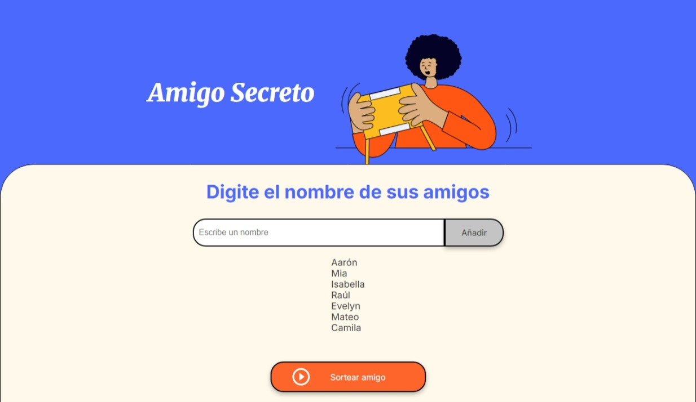
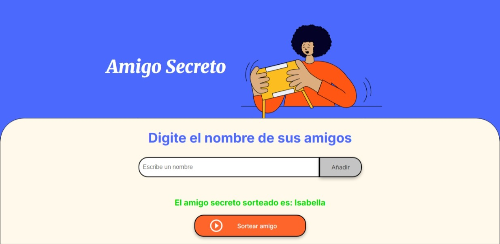

# 🎁 Challenge-amigo-secreto_alura-latam
Este es un proyecto web simple e interactivo que permite a los usuarios ingresar nombres de amigos en una lista y realizar un sorteo aleatorio para elegir al "amigo secreto" entre los participantes.
---
## 🌐 Descripción
El objetivo de este proyecto es ofrecer una forma práctica y divertida de sortear un amigo secreto entre un grupo de personas. Los usuarios pueden ingresar nombres en una lista, y con un solo clic se selecciona aleatoriamente uno de ellos como el "amigo secreto sorteado".
---
## 🚀 Tecnologías utilizadas
- **HTML5** – Estructura del sitio.
- **CSS3** – Estilos personalizados, tipografía y diseño visual adaptable.
- **JavaScript** – Lógica para agregar nombres, mostrar la lista y realizar el sorteo.
---
## 📸 Captura



---
## 🛠️ Cómo usar

1. Clona el repositorio:

   ```bash
   git clone https://github.com/aaizaguirre/challenge-amigo-secreto_alura-latam.git
   ```
2. Abre el archivo "index.html" en tu navegador.
3. Escribe nombres en el campo de entrada y haz clic en "Añadir".
4. Una vez agregados los nombres, haz clic en "Sortear amigo" para mostrar el resultado.
---
## ✨ Características
- Añadir múltiples nombres de forma dinámica.
- Evita nombres vacíos.
- Resultado visual estilizado.
- Reinicia la lista tras el sorteo.
- Diseño limpio, adaptable y visualmente atractivo.
---
## 🧠 Posibles mejoras
- Validar que no se repitan nombres.
- Permitir múltiples sorteos sin recargar la página.
- Agregar botón para reiniciar sin sortear.
- Añadir animación o sonido al mostrar el resultado.
- Soporte para sortear más de un amigo secreto (emparejamientos).
---
## 📁 Estructura del proyecto
```bash
    amigo-secreto/
    │
    ├── index.html                     # Página principal
    ├── style.css                      # Estilos del sitio
    ├── app.js                         # Lógica del proyecto
    ├── assets/                        # Imágenes, íconos y recursos
    │   └── amigo-secreto.png
    │   └── amigo-sorteado.jpeg
    │   └── lista-amigos.jpeg
    │   └── play_circle_outline.png
    └── README.md                      # Documentación del proyecto
```
---
## 👨‍💻 Autor
**Aarón Izaguirre Olortegui**
📍 Lima, Perú.
🎓 Bachiller en Ciencias Forestales - Universidad Nacional Agraria La Molina.
💡 Autodidacta en ciencia de datos y Back - End.
🧠 Interesado en proyectos IoT, automatización y tecnologías que integren naturaleza y tecnología.
---
## 📄 Licencia
Este proyecto está bajo la licencia MIT.
Puedes usarlo, modificarlo y compartirlo libremente.